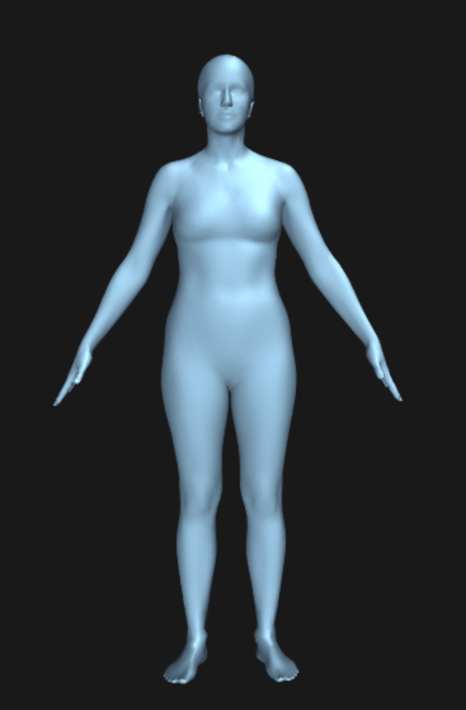

Eksempel på stilstamkort.


```
## [1] "You have selected:"
```


##Personligt


**Navn:** Inge Biering

**Alder:** 37

**Beskæftigelse:** Medicin 


**Fuld figur billede:**


###Størrelser

**Højde:** 172 cm

**Vægt:** 80 kg

**BMI:** 27

**BH:** C 80

**Kjole:** M, L, 40, 42

**Overdel:** M, L, 38, 40, 42

**Underdel:** M, L, 40, 42

###Kropsform
**Skuldre/hofter:** skuldre og hofter er lige brede.

**Overkrop/underkrop:** Gennemsnitlig benlængde i forhold til overkrop.

**Særligt vedr. kropsform, der skal tages hensyn til:** [NA]



##StilDNA

 

*Stilscore (fra 0 til 6 på hver platform):*

<!--
Afslappet: 1
Boheme: 0
Enkel: 3
Feminin: 3
Klassisk: 4
Rå: 0
-->

**Kommentar til billeder:** [NA]

**Det tøj jeg har det bedst i:** [NA] 


**Mærker i skabet:** InWear, Max Mara, Vero Moda, Noa Noa, Edith & Ella, Part Two, Moss Copenhagen, Cos, Day, H&M

**Eventyrlyst:** Jeg vil godt have nogle anderledes stykker tøj ind i mellem.


**Kjoler eller bukser:** Mest kjoler.

**Dresscode:** [NA]

**Budget pr md (tidligere år) uden sko: kr** [NA]

**UNDGÅ:**

**Materialer:** [NA]

**Farver:** [NA]

**Print:** [NA]

**Det vil jeg aldrig gå med:** [NA]


###Hvordan skal tøjet sidde

**Løst eller tæt på overkrop?:** Det er blandet, hvad jeg kan lide.

**Løst eller tæt på underkrop?:** Det er blandet, hvad jeg kan lide.

**Det vil jeg gerne vise frem:** [NA]

**Det vil jeg gerne dække:** Mave

###Ekstra info

*Pinterest:*
http://

*Kommentarer:*
[NA]


